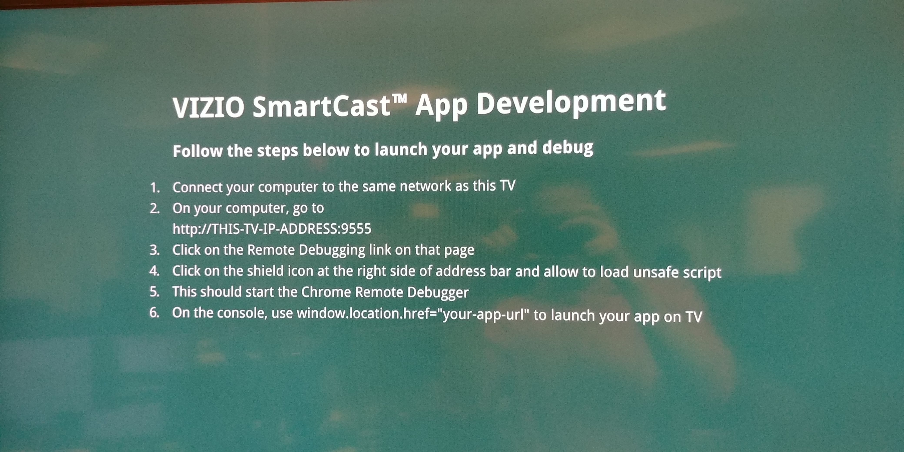

# Vizio Smartcast Deployment

## Dev and Debug

In the instructions below the app url refers to the officially hosted one (e.g. https://ctv.truex.com/web/ref-app/master/index.html), or else your current dev machines locally hosted one, as per the `npm start` command (e.g. http://192.168.1.72:8080).

### To launch a web app (SmartCast 3)
For basic execution on market (retail) TV models as well as development enabled models you can cast the app to the TV as follows:
* Use the following launcher in Chrome for casting:  
  http://vizio-pm.s3-us-west-1.amazonaws.com/conjure-launcher.html
* This launcher app will first pair your web page with the TV via the PINCODE
  method (just like the mobile app), and then help you launch the app via REST
  command behind the scene.
* Use this approach by default, it has the least memory impact, which is important for long video playback
  on constrained models like the Smartcast D-series.

### To debug a web app (SmartCast 3)
For debugging Smartcast 3.x models and up, you will need a development enabled TV model:
* Ensure that the TV is in development mode (enabled explicitly by Vizio) 
* Ensure that the TV is on the "Smartcast" input view.
* Repower the TV to get the development home page, follow the on screen instructions, e.g.
* 
* Open “chrome://inspect” within your Chrome web browser to launch the developer tools.
* Note: If you're still having issues connecting to the Vizio TV device with the chrome use these steps:
    - Close your chrome browser, and run these command in a terminal:  
    `/Applications/Google\ Chrome.app/Contents/MacOS/Google\ Chrome --allow-running-insecure-content` 
    - Retry the above step with instance of chrome running.

### To launch a web app (official) (SmartCast 2)
1. Go to http://scfs.vizio.com/html5-app-dev-launcher/cast-launcher-sender.html in *GOOGLE CHROME*
1. Put in the URL of the Web App
1. Click "Launch URL"
1. Pick your TV

### To launch a web app (official) (SmartCast 2)
Same as above, but go to http://scfs.vizio.com/html5-app-dev-launcher/cast-launcher-sender.html instead
